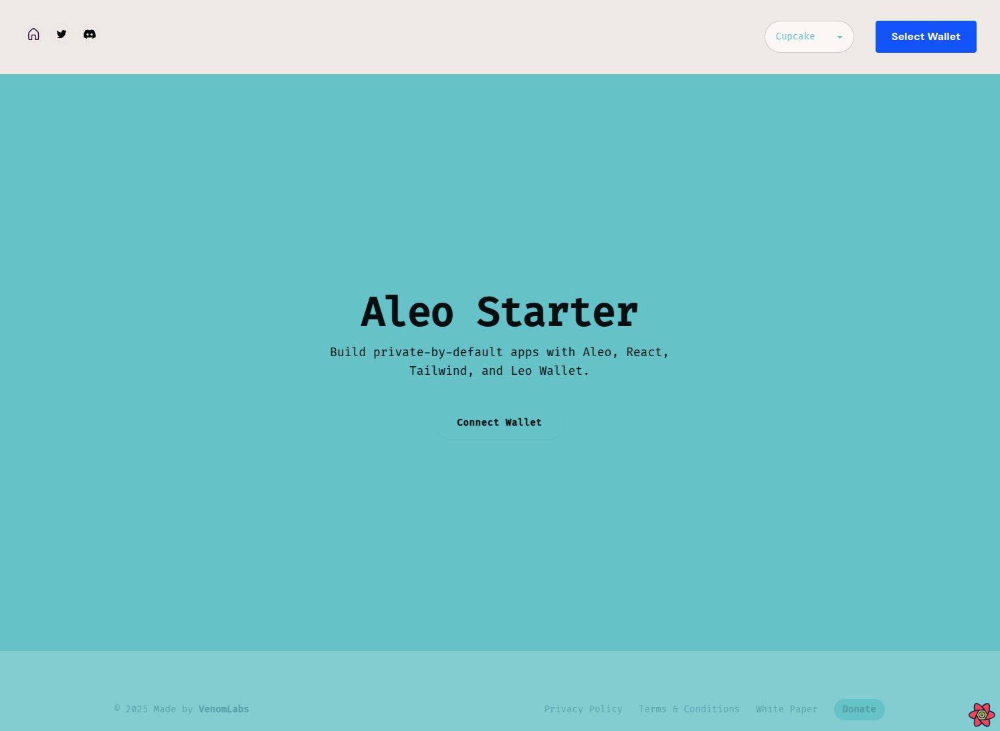

# 🛠️ Aleo Starter Template

💡 This template is open-sourced to help others build on Aleo faster — even if it means creating our own competition. The goal is to grow the ecosystem and make privacy-first apps more accessible for everyone!


A modern, open-source starter template for building **Aleo dApps** with:

- [Next.js](https://nextjs.org/) + [TypeScript](https://www.typescriptlang.org/)
- [Tailwind CSS](https://tailwindcss.com/) + [DaisyUI](https://daisyui.com/)
- Integrated [Leo Wallet](https://www.aleo.org/post/leo-wallet) support
- Light/dark mode and reusable UI components
- Bonus: Aleo program examples, fee calculation, private/public transfers, and more

---

## ⚡ Features

✅ Wallet Connect w/ Leo Wallet  
✅ Tailwind + DaisyUI pre-configured  
✅ Dark mode toggle out of the box  
✅ Reusable component & layout structure  
✅ Aleo RPC interaction examples  
✅ Ready-to-use file structure  
✅ Built for dev speed & extensibility

---

## 🚀 Quick Start

```bash
git clone https://github.com/mikenike360/aleo-starter-template.git
cd aleo-starter-template
yarn install
yarn dev
```

Then open [http://localhost:3000](http://localhost:3000) in your browser.

---

## 🔐 Wallet Integration

This template includes Leo Wallet browser extension support.


## 🧩 Example Aleo Program

Includes a demo `main.leo` program and compiled build:

```bash
cd program
leo build
```

You can replace this with your own program and wire it into the frontend via Aleo RPC or your preferred method.

---

## 🔄 Switching to Aleo Mainnet

By default, this template connects to the Aleo **testnetbeta** environment.  
To switch to **mainnet**, follow these steps:

1. Open `src/types/index.ts`
2. Change the `CURRENT_NETWORK` and `CURRENT_RPC_URL` constants to point to mainnet endpoints
3. Then open `src/pages/_app.tsx` and change the `network` prop for `WalletAdapterNetwork` from:
```ts
network={WalletAdapterNetwork.TestnetBeta}
```
to:
```ts
network={WalletAdapterNetwork.MainnetBeta}
```

You are now ready to build against Aleo mainnet!

---

## 📦 Project Structure

```
.
├── /program/         ← Sample Leo program
├── /src/
│   ├── assets/       ← Global styles
│   ├── components/   ← UI + wallet connect
│   ├── hooks/        ← Custom React hooks
│   ├── layouts/      ← Page structure
│   ├── pages/        ← Next.js routes
│   ├── types/        ← TypeScript types
│   └── utils/        ← Aleo-specific helpers
```

---

## 🧠 Bonus Utilities (Optional)

- [`utils/feeCalculator.ts`](./src/utils/feeCalculator.ts) – helpful for estimating transaction costs
- [`utils/privateTransfer.ts`](./src/utils/privateTransfer.ts) – Aleo private transfer logic
- [`utils/publicTransfer.ts`](./src/utils/publicTransfer.ts) – public transfer example
- [`utils/GLSLBackground.tsx`](./src/utils/GLSLBackground.tsx) – dynamic background component

These are **not required** but useful if you plan to build more complex interactions.

---

## 🤝 Use This Template

You can click **“Use this template”** on GitHub to instantly clone and start building.

---

## 📸 Screenshot




---

## 🧑‍💻 Author

Built by [@mikenike360](https://github.com/mikenike360) from [VenomLabs](https://venomlabs.xyz)

---

## 🌐 License

MIT – free to use, modify, and share.
